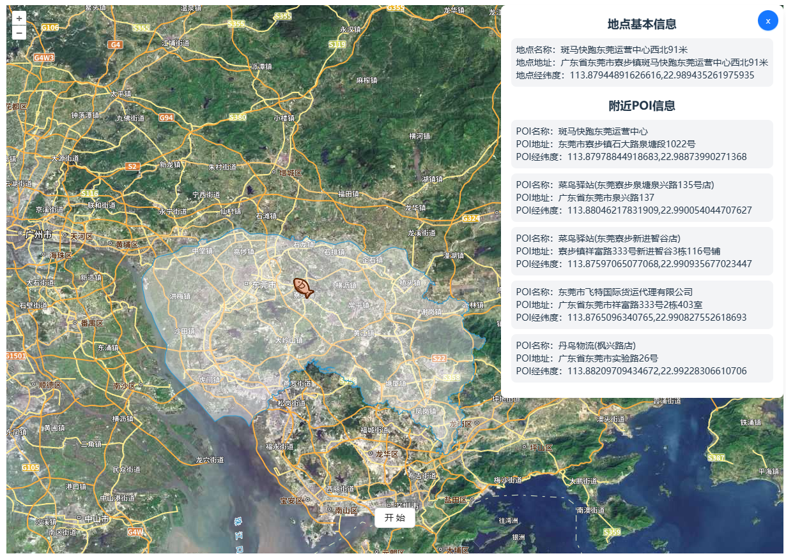

# Find random place to travel（小鱼出行）

- 随机生成目的地。
- 地图上展示目的地位置及周边地点。

## Start
### before
  准备一个天地图的Token和百度地图的AK，修改.env里天地图和百度的key
  ```
  # .env
VITE_TDT_API_KEY=""
VITE_BAIDU_MAP_AK=""
VITE_OPENAI_API_KEY=""
VITE_POI_TYPES="生活服务|餐饮服务|风景名胜|科教文化服务|地名地址信息"
  ```
### install
  ```
  pnpm install
  ```
### run
  ```
  pnpm dev
  ```
### build
  ```
  pnpm build
  ```

## Plan
- 优化展示UI
- 添加导航功能
- 添加查询目录地天气功能
- 添加选择目的地范围功能（目前只有东莞）
- 支持三维展示
- more